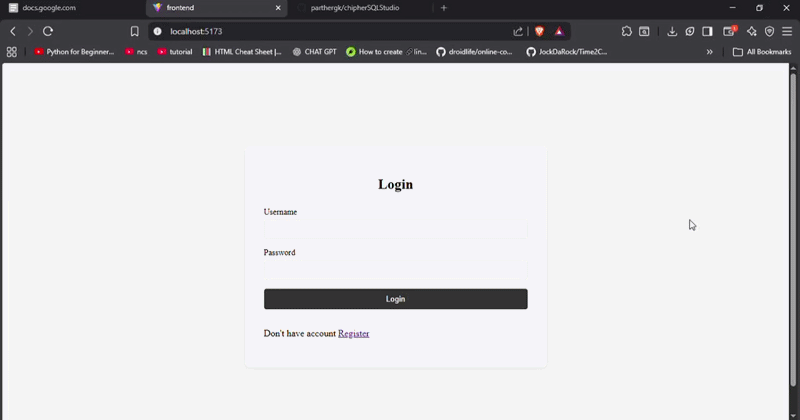
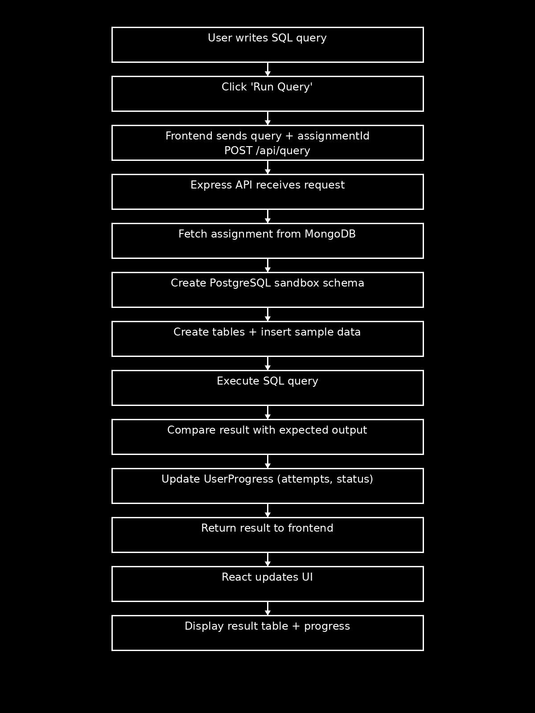

# CipherSQLStudio
A browser-based SQL practice platform where students can write and execute SQL queries on predefined assignments with intelligent hints.

## Demo



## Tack Stack
Frontend
- React.js
- SCSS
- Monaco Editor

Backend
- Node.js
- Express.js

Database
- PostgreSQL (query sandbox)
- MongoDB (assignments & user progress)

AI
- Google Gemini API for hint generation

## Setup Instructions

### 1. Clone the Repository
```bash
git clone https://github.com/parthergk/chipherSQLStudio.git
```
### 2. Go inside project
```bash
cd cipherSQLStudio
```

### 3. Install Dependencies

#### Backend
```bash
cd backend
npm install
```

#### Frontend
```bash
cd frontend
npm install
```

### 4. Environment Variables

Create a `.env` file inside the **backend** folder.

Use the variables provided in the `.env.example` file.

Example:

```bash
cp .env.example .env
```

Then update the values according to your local setup.

### 5. Run the Project

#### 1. Run script to create assignments
```bash
cd backend
npm run seed
```

#### 2. Start Backend Server
```bash
npm run dev
```

#### 3. Start Frontend Server
```bash
cd frontend
npm run dev
```

After running both servers, the application should be available locally.

## Features
- View SQL assignments
- Run SQL queries in Monaco Editor
- See query results instantly
- AI-powered hints
- Track user progress

## Data Flow Diagram

